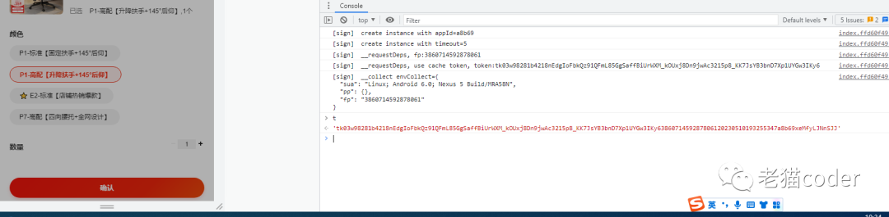
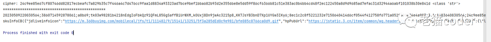

# h5st
京东h5st分析,一共8个参数：

## 1.20230509220030564;

## 2.3860714592878061;

## 3.a8b69;

## 4.tk03w98281b4218nEdgIoFbkQz91QFmL85GgSaffBiUrWXM_kOUxj8Dn9jwAc3215p8_KK7JsYB3bnD7Xp1UYGw3IKy6;

## 5.8ec1c2c8f5221232e7150640414d6cf0544f412758f6771a0529330074e4a987;

## 6.3.1;

## 7.1683640830564;

## 8.24c9ee85e67cf80746dd82817ecbeafc7a829b35c7f446a4c7d476cc9faa1d8834a93323ad7bce9bef1bba682b93d2e355d6e8e5dd59f86cf6366b81c51e383ac0b4bb4cd48f2ec122450a8d9d9685ad7efac31d32944a6abf101038b30e841d

### 3 构造参数请求
## 结果:

